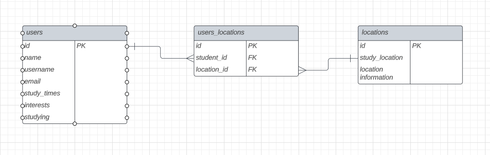
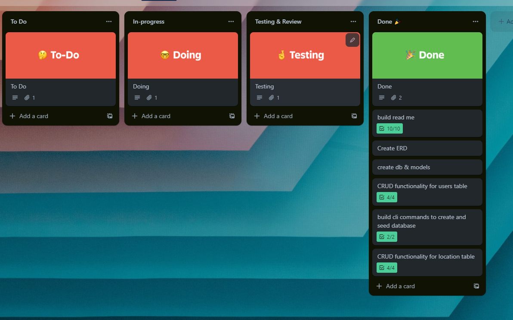
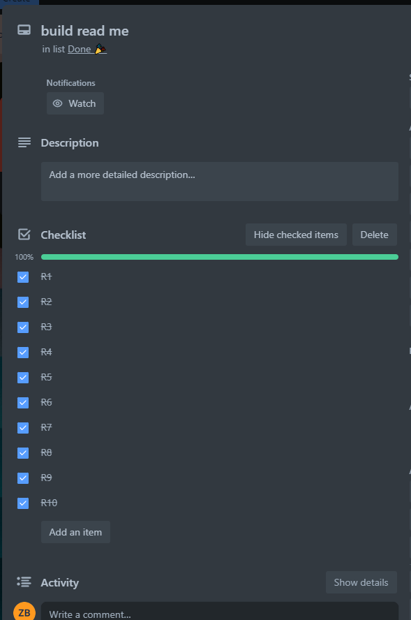
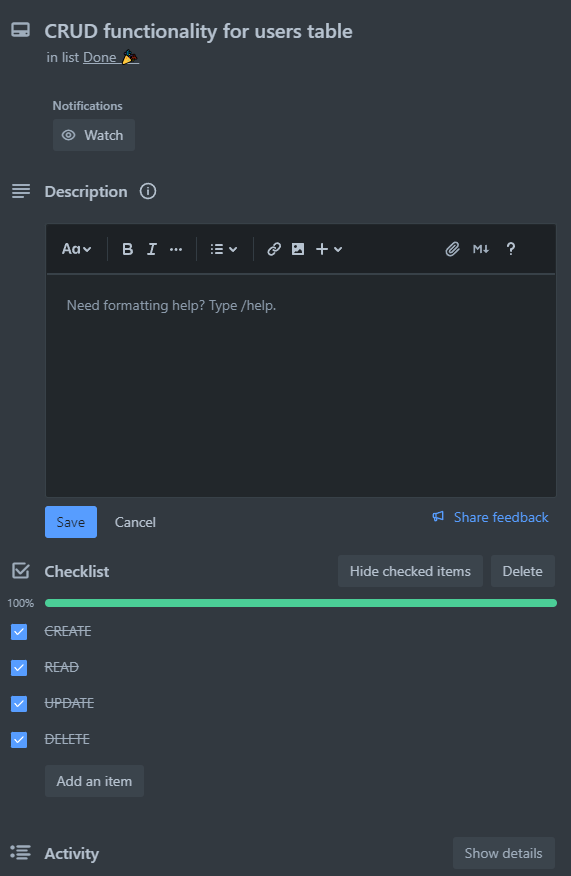
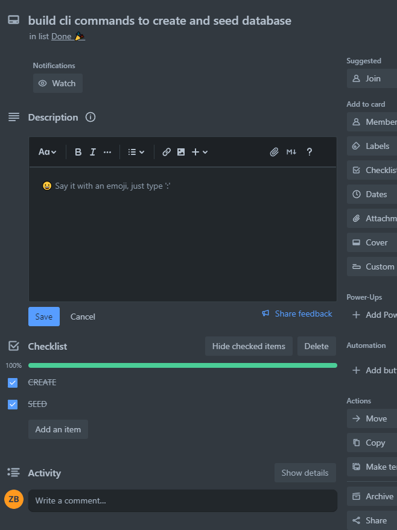

# **API Webserver Project T2A2**

## **Table of Contents**

### **Installation** 

Create a database in PSQL, connect to the database and create a user with privileges to begin

```
CREATE DATABASE study_buddy_db;
```
```
\c study_buddy_db;
```
```
\c study_buddy_db;
```
```
CREATE USER api_dev WITH PASSWORD 'hunter2';
```
```
GRANT ALL PRIVILEGES ON DATABASE our_school_db TO api_dev;
```
Then create and activate a virtual environment, then install the dependencies required

```
python3 -m venv .venv
source .venv/bin/activate
pip install -r requirements.txt
```

Next use the .env.sample file to create your .env, enter the db URI and create a secret JWT key

### CLI Commands

```
flask db create
```
This will create the database tables

```
flask db seed
```
This will seed the database with example data

### **R1: Identification of the problem you are trying to solve by building this particular app.**

This app is to help students are universities and other higher education locations find other students to study with to assist them by studying in groups.


### **R2: Why is it a problem that needs solving?**

Studying in groups has proven benefits for students, in that it can help retain information better than studying alone. Whether thats bouncing ideas off each other, or even quizing each other on particular subjects, as mentioned
[here](https://www.oxfordlearning.com/studying-alone-vs-studying-in-a-group/) and
[here](https://www.studyusa.com/en/a/1980/better-to-study-alone-or-in-a-group). Not to mention studying in groups can even help neurodivergent students as for example students with ADHD can gain significant benefits from a technique called 'body doubling', which is when they work along side someone whether they ar working togther or independly next to each other, it can help keep the student with ADHD on task, as mentioned [here](https://add.org/the-body-double/)

### **R3: Why have you chosen this database system. What are the drawbacks compared to others?**

Reasons for choosing PostgreSQL:

Relational database: PostgreSQL is a powerful open-source object-relational database management system (ORDBMS) that supports a wide range of features for handling complex data relationships. It adheres to the SQL standard and provides strong ACID (Atomicity, Consistency, Isolation, Durability) compliance, making it suitable for transactional and data-intensive applications.

Flexibility: PostgreSQL offers a high degree of flexibility, allowing users to define custom data types, write stored procedures, and create user-defined functions. It supports a wide range of data types, including arrays, JSON, and geometric data. This flexibility enables developers to tailor the database to meet specific application requirements.

Extensive features: PostgreSQL provides a rich set of features, including advanced indexing mechanisms, full-text search, support for geographic information systems (GIS), and support for concurrency control mechanisms such as MVCC (Multi-Version Concurrency Control). These features make it suitable for handling complex and diverse data workloads.

Community support and active development: PostgreSQL benefits from a large and active community of users and developers who contribute to its ongoing development and improvement. This community-driven approach ensures a steady stream of updates, bug fixes, and new features.

Drawbacks compared to other database systems:

Performance limitations: While PostgreSQL has made significant improvements in performance over the years, some other database systems, such as specialized NoSQL databases or distributed databases, may outperform it in certain scenarios. PostgreSQL's performance can be impacted by factors like poor query optimization, lack of proper indexing, or suboptimal database design.

Learning curve: PostgreSQL can have a steeper learning curve compared to simpler and more lightweight database systems. Its extensive feature set and flexibility come with a trade-off of increased complexity, which may require more time and effort to master.

Scalability challenges: Although PostgreSQL can handle large-scale databases, it may face scalability challenges when compared to some distributed database systems designed specifically for high scalability and big data workloads. Scaling PostgreSQL vertically (adding more resources to a single server) is relatively straightforward, but horizontal scaling (distributing the workload across multiple servers) can be more complex.

Limited built-in replication: PostgreSQL provides built-in replication mechanisms such as streaming replication and logical replication, which are effective for high availability and read scalability. However, compared to some other databases, it may lack certain advanced replication features, such as automatic sharding or built-in support for multi-master replication.

It's important to note that the suitability of a database system depends on the specific requirements and constraints of your application. While PostgreSQL may have certain drawbacks compared to other databases in certain scenarios, it remains a robust and versatile choice for many use cases, especially when strong data consistency, reliability, and advanced SQL capabilities are paramount.

### **R4: Identify and discuss the key functionalities and benefits of an ORM**

An ORM (Object-Relational Mapping) is a software technique that allows developers to map objects in an object-oriented programming language to relational database tables. It provides a way to interact with a database using object-oriented paradigms, abstracting away the low-level details of database operations. Here are some key functionalities and benefits of using an ORM:

Object-Relational Mapping: The primary functionality of an ORM is to handle the mapping between objects and database tables. It automatically converts objects into database records (rows) and vice versa, eliminating the need for developers to write manual SQL queries for common CRUD (Create, Read, Update, Delete) operations. This abstraction simplifies database interaction and allows developers to work with objects directly.

Database independence: With an ORM, you can write code that is independent of the underlying database management system (DBMS). The ORM provides a consistent API for interacting with databases, abstracting the differences in SQL dialects and database-specific quirks. This portability allows developers to switch between different database systems without significant code changes.

Query generation and optimization: ORMs often provide query generation capabilities, allowing developers to construct complex database queries using high-level methods or a query language specific to the ORM. The ORM translates these high-level queries into optimized SQL queries, taking care of join optimizations, index usage, and other performance considerations. This functionality simplifies query construction and helps optimize database performance.

Data validation and type conversion: ORMs often provide mechanisms for data validation and type conversion. They can enforce data integrity by validating object attributes against predefined rules or constraints. Additionally, ORMs handle type conversions between the object-oriented data types and the corresponding database data types, ensuring data consistency.

Relationships and associations: ORMs facilitate the management of relationships and associations between objects. They provide features like lazy loading, eager loading, and automatic relationship traversal, allowing developers to navigate and manipulate complex relationships between objects with ease. ORMs handle the complexities of joins and foreign key constraints, simplifying the interaction with related data.

Object caching and performance optimizations: Some advanced ORMs offer features like object caching and query result caching. Caching can improve application performance by reducing the number of database queries, especially for frequently accessed or read-heavy data. By caching objects and query results, the ORM can minimize round-trips to the database and improve response times.

Code organization and maintainability: ORMs promote a clean and structured code organization by separating the data access logic from business logic. By encapsulating database operations within the ORM, developers can focus on the business domain without getting entangled in low-level database details. This separation improves code maintainability, testability, and readability.

Database schema management: Many ORMs offer tools and utilities to manage database schema changes. They can automatically generate database migration scripts based on changes in the object model, simplifying the process of evolving the database schema over time. This functionality aids in versioning and maintaining consistency between the application's object model and the underlying database.

While ORMs offer numerous benefits, it's important to consider their limitations and potential performance trade-offs. They may introduce additional overhead and complexity, and certain complex or specialized database operations may still require custom SQL queries. It's crucial to evaluate the specific needs of your application and choose an ORM that aligns with your requirements and performs well in your target environment.

### **R5: Document all endpoints for your API**

/users

- Get request will list all users

/users/id

- GET request will return the user with that specified id
- PUT or PATCH will allow you to update specific entries on the specified user
- DELETE will remove the specified user


/locations

- Get request will list all locations

/locations/id

- GET request will return the location with that specified id
- PUT or PATCH will allow you to update specific entries on the specificed location
- DELETE will remove the specified location

/login

- POST request will allow you to login to a user account

/register

- POST will allow you to register a new user

### **R6: An ERD for your app**



### **R7: Detail any third party services that your app will use**


**Flask**

Flask is a popular Python web framework that allows developers to build web applications quickly and with ease. It is designed to be lightweight, flexible, and easy to use, making it a popular choice for both beginners and experienced Python developers. Flask follows the Model-View-Controller (MVC) architectural pattern, but it provides developers with the flexibility to choose their preferred approach to application structure.

**SQLAlchemy**

SQLAlchemy is an open-source Python library that provides a set of tools for working with relational databases using the SQL language. It is commonly used as an Object-Relational Mapping (ORM) tool, allowing developers to interact with databases using Python objects and methods instead of writing raw SQL queries.

**Bcrypt**

bcrypt is a widely used hashing algorithm specifically designed for password hashing. It is known for its security and resistance to brute-force attacks. bcrypt is an adaptive hashing algorithm, which means it can be configured to be intentionally slow, making it computationally expensive for attackers to crack passwords.

**Psycopg2**

Psycopg2 is a popular PostgreSQL adapter for the Python programming language. It is a library that provides an interface to interact with PostgreSQL databases from Python applications. Psycopg2 allows developers to connect to a PostgreSQL database, execute SQL queries, and work with the data returned from the database.

**Flask-Marshmallow**

Flask-Marshmallow is an extension for the Flask web framework that integrates the Marshmallow library, which is a popular Python library for object serialization and deserialization. Flask-Marshmallow simplifies the process of validating and serializing data in Flask applications by providing seamless integration between Flask and Marshmallow.

**Python-Dotenv**

Python-Dotenv is a Python library that simplifies the process of loading environment variables from a .env file into your Python applications. It allows you to store configuration settings, API keys, database connection strings, and other sensitive information in a separate file, rather than hardcoding them into your codebase.

### **R8: Describe your projects models in terms of the relationships they have with each other**

**Users**

id: This column is typically an auto-incrementing integer or a unique identifier that serves as a primary key for each user record. It ensures the uniqueness of each user in the table.

name: This column stores the user's name, typically as a string. It allows you to store and retrieve the name of each user.

email: This column is used to store the user's email address. It provides a means of identifying users and can be used for communication or authentication purposes.

password (stored as a hash): This column stores the hashed representation of the user's password. Storing passwords as hashes improves security by ensuring that the actual password remains confidential. When a user logs in, their entered password is hashed and compared to the stored hash for authentication.

study_times: This column represents the user's study times, such as their preferred study hours or a schedule. It can store this information in a format suitable for your application, such as a string or a serialized object.

interests: This column captures the user's interests, such as subjects or topics they are interested in studying. It allows you to store and retrieve information about the user's preferences.

studying: This column can be a boolean (true/false) field that indicates whether the user is currently studying. It provides a way to track and update the user's studying status.

is_admin: This column can also be a boolean field that signifies whether the user has administrative privileges or not. It is useful for implementing access control and differentiating between regular users and administrators.

study_locations (relationship with the location table): This column establishes a relationship between the "User" table and the "Location" table. It represents a many-to-many relationship, indicating that a user can be associated with multiple study locations, and a study location can be associated with multiple users. This relationship is typically implemented using a join table, as described in our previous discussion.

By organizing your user data into these columns, you can efficiently store and retrieve information about each user, including their personal details, study preferences, and associations with study locations.

**Location model**

id: This column serves as a unique identifier or primary key for each location record. It ensures the uniqueness of each location in the table.

name: This column stores the name or title of the location, typically as a string. It provides a way to identify and refer to each location.

description: This column allows you to provide a description or additional details about the location. It can be used to provide information such as the amenities available, the environment, or any specific characteristics of the location.

users_locations (relationship with the user table): This column represents a relationship between the "Location" table and the "User" table. It establishes a many-to-many relationship, indicating that a location can be associated with multiple users, and a user can be associated with multiple locations. This relationship is typically implemented using a join table, which allows you to track and manage the associations between users and locations.

The "users_locations" relationship column acts as a bridge between the "Location" and "User" tables, enabling the mapping of the many-to-many relationship. It allows you to associate users with specific locations and vice versa, providing flexibility in managing the relationship between the two entities.

By utilizing these columns in your "Location" table, you can store information about each location, including its name, description, and the users associated with it. This structure allows for efficient retrieval and manipulation of data, enabling you to track user-location associations and retrieve relevant information as needed.

### **R9: Discuss the database relations to be implemented in your application**

In the project, there is a Many-to-Many relationship between two entities: User and Location. This means that multiple users can be associated with multiple locations, and vice versa. To implement this relationship in Flask, a join table is used. The join table serves as an intermediary table that connects the User and Location entities. It contains foreign key references to the primary keys of both tables, establishing the many-to-many relationship. The join table acts as a bridge between the User and Location models, allowing the mapping of the many-to-many relationship. It enables efficient querying and manipulation of the relationship data, providing a convenient way to manage the associations between users and locations. By utilizing a join table, Flask provides a flexible and scalable solution for handling many-to-many relationships, ensuring data integrity and ease of data retrieval between the User and Location entities.

### **R10: Describe the way tasks are allocated and tracked in your project**

Managed the project mainly through trello, and completing standups on discord throughout the project




